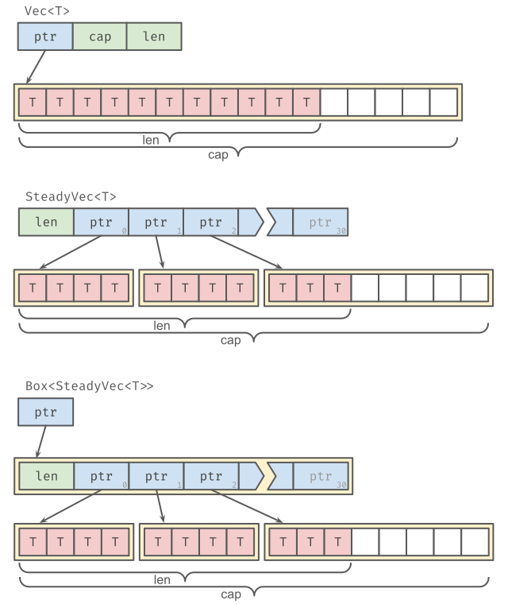

`steady_vec`
===============

`SteadyVec` is a "`Vec`-like" datastructure that on *resize* leaves existing
elements where they are, and uses the new allocation only for subsequent items.

### why?

When a `Vec` becomes full, it *resizes*, which is a process of allocating a new
vector with twice the capacity and then moving every element from the original
vector into the new vector. Sometimes you need a growable "vector-like" thing
but you can't or don't want elements to move on resize.

Trade-offs:
- It is not possible to get slices over arbitrary ranges, as the underlying
  elements may not be contiguous in memory.
- `SteadyVec<T>`'s size is large (~264 bytes), so stack moves are more
  expensive. You can use a `Box<SteadyVec<T>>` instead, but that requires an
  extra indirection for every access.

Since `SteadyVec` guarantees that elements will not move when growing, it may
be a useful primitive for certain datastructures design for concurrent access.

Future work
-----------

Much of the API surface area of `Vec` has been replicated for `SteadyVec`, but
there are still outstanding methods & traits including:

- binary_search
- sort
